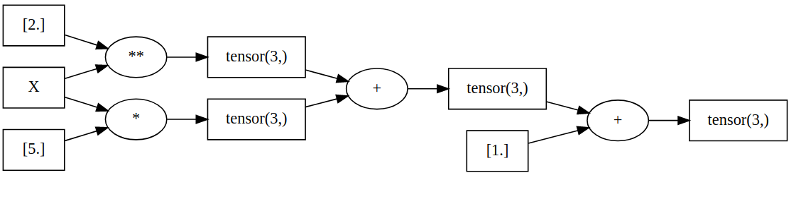
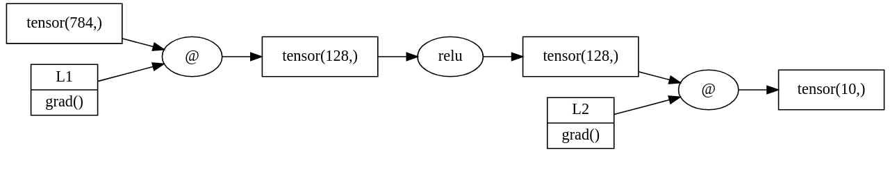
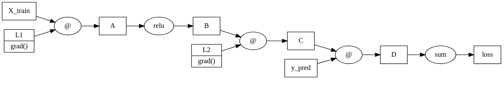
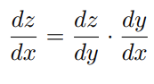
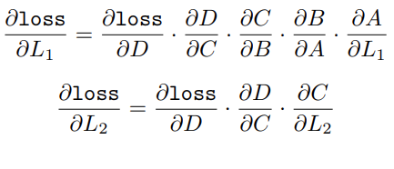
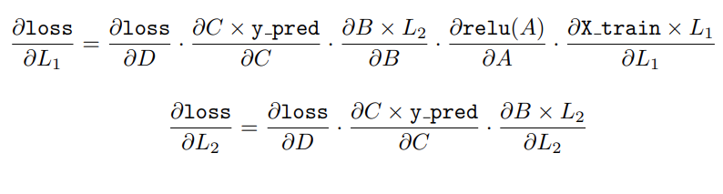
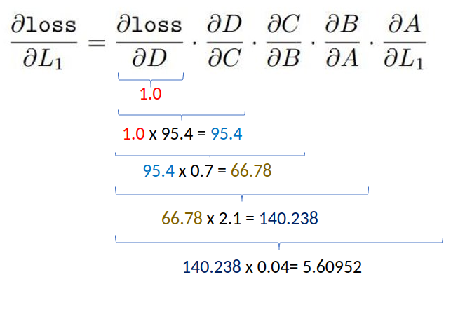

# edunets

Edunets is a very simple automatic differentiation engine built to be easily understood and give a better insight on how neutal networks work under the hood. It focuses solely on the algorithmic aspect of the automatic differentiation, so it has no GPU support and no massive optimizations.

The notebook ```notebooks/demos.ipynb``` demonstrates some of the things edunets can do.

## Installation

```bash
pip3 install https://github.com/goncalogiga/edunets
```

## Introduction

### Loss, chain rule and optimizer from scratch

The main class ```Tensor``` defined under ```edunets/tensor.py```, acts like a wrapper arround a numpy array, in order to track every operation done to the tensor. For example, this is the graph that tracks some operations done on a tensor X:

```python
import numpy as np
from edunets.tensor import Tensor

X = Tensor([1.0, 2.0, 3.0], label='X')
result = X**2 + 5*X + 1
assert (result.data == np.array([7.0, 15.0, 25.0])).all()
result.graph
```



The reason we keep this 'operation' graph is so we can calculate gradients that can then be used to optimize the weights of neural networks layers. This is clearer if we consider an actual neural netowrk. Here is a simple two layered neural network with linear layers and a reLU activation function. This can be used to classify the MNIST dataset:

```python
class EduNet1:
    def __init__(self):
        stdv1, stdv2 = 1./np.sqrt(28*28), 1./np.sqrt(128)
        self.l1 = Tensor.uniform(128, 28*28, low=-stdv1, high=stdv1, requires_grad=True, label="L1")
        self.l2 = Tensor.uniform(10, 128, low=-stdv2, high=stdv2, requires_grad=True, label="L2")

    def __call__(self, x):
        return (x @ self.l1.T).relu() @ self.l2.T

model = EduNet1()
model(Tensor.uniform(28*28)).graph
```



We can see both the layer L1 and L2 have ```requires_grad``` set to ```True```. This is because those are the two gradients we care about. After passing a 28x28 image through this model, we get a vector with 10 values, each corresponding to the network's confidence that the input image is the digit corresponding to the vector's index.

Once we have the model's prediction, we can compare it to the real label the input had. This is done via the loss function. A loss function compares the predictions with the true labels of the training data and outputs a score on how well the model is peforming at the classification task.

"Training" the model actualy means updating the values in the L1 and L2 matrices so they give better and better outputs when predicting the digits. This is why we keep their gradients. Gradients are basicly derivatives and we know derivatives give information about the slope of a function. The "derivative" of the loss with respect to L1 will give us information (thanks to the slope) on how L1 impacts the loss' behavior. Since we want to minimize the loss, we just have to change L1, given the information of the "derivative", so that the loss will decrease after we change L1 (same thing for L2).

It's for this reason we keep the "operation" graph, because we want to be able to compute the gradient (ie. the "derivative") of the loss with respect to the layers. The entire "operation" graph is necessary since the derivatives are calculated using the chain rule, which involves every operations, from the model to the loss calculation.

Let's use a dummy loss that takes the sum of the dot product between the prediction and the true label and add a name to each operation:

```python
# Dummy Loss: (input @ target).sum()

model = EduNet1()
input, target = Tensor.uniform(28*28, label="X_train"), Tensor([1.0] + 9*[0.0], label="y_pred")
s1 = input @ model.l1.T; s1.label = "A"
s2 = s1.relu(); s2.label = "B"
s3 = s2 @ model.l2.T; s3.label = "C"
s4 = s3 @ target; s4.label = "D"
loss = s4.sum(); loss.label = "loss"
loss.graph
```



We get the graph with every intermediate step labeled. As we mentioned, the goal is now to get the "derivative" of the loss with respect to L1 and L2. This is done using the chain rule, a calculus formula.

Mathematicly, the chain rules states that, if a variable z depends on the variable y, which itself depends on the variable x, then z depends on x as well, via the intermediate variable y. The chain rule is therefore expressed as:



We can think of the chain rule as "simplifying" the dy in the multiplication of the derivatives. 

Having the chain rule formula, it's easy to apply it to our previous graph in order to get the formulas of the two derivates we are intrested in:



Of course, every label corresponds to an actual function that we can also explicitly write:



It should be clear why we actualy need to register every operation an input goes through up to the final loss score computation. Without the intermediate operations, we don't have enough informations to calculate the gradients we need in order to correctly update the weights of L1 and L2.

In practice these computations are done by [topologicaly sorting the "operation" graph](https://en.wikipedia.org/wiki/Topological_sorting#:~:text=In%20computer%20science%2C%20a%20topological,before%20v%20in%20the%20ordering.). This makes it so we can descend the graph starting from the ```loss``` node and always calculate the gradients (derivatives) and then use previous gradients calculation to multiply them together and progressivly compute the entire chain. This is illustrated in the following picture (values don't mean anything here, this should actualy be matrices insted of scalars):

<p align="center">

</p>

All these computations can be done by calling the ```backward()``` method on the last node of the graph. After all the backward passes are computed, we can check the value of the L1 gradient:

```python
print("Gradient of L1 before backward pass:", model.l1.grad)
loss.backward()
print("Gradient of L1 after backward pass:", model.l1.grad)
```

```python
Gradient of L1 before backward pass: None
Gradient of L1 after backward pass: [[-0.00776756 -0.00902132 -0.00229285 ... -0.00229511 -0.0002794
  -0.01371739]
 [-0.03960229 -0.04599447 -0.01168991 ... -0.01170141 -0.00142448
  -0.06993698]
 [ 0.04102574  0.04764769  0.01211009 ...  0.012122    0.00147568
   0.07245078]
 ...
 [ 0.04925122  0.05720084  0.01453811 ...  0.01455241  0.00177155
   0.08697684]
 [ 0.01209177  0.0140435   0.00356928 ...  0.00357279  0.00043494
   0.02135387]
 [-0.02743734 -0.031866   -0.00809903 ... -0.00810699 -0.00098691
  -0.0484539 ]]
```

The final step is to use these gradients to update the values of L1 and L2, which act like the weights of our very simple neural network. Updating the weights is done by what is called an optimizer; a very simple and common optimizer is the [stochastic gradient descent algorithm](https://en.wikipedia.org/wiki/Stochastic_gradient_descent). We will not go over the theory of this algorithm here, since what matters to us is that this gives us a mathematical expression that can update the values of L1 and L2, using their gradients, in a way that will eventualy tweak the loss in order to make it decrease. This is the class defining the stochastic gradient descent:

```python
class SGD:
    def __init__(self, params, lr=0.001):
        self.lr = lr
        self.params = params

    def step(self):
        for t in self.params:
            # formula for the stochastic gradient descent (updates L1 and L2)
            t.data = t.data - t.grad * self.lr

    def zero_grad(self):
        for param in self.params:
            param.zero_grad()
```

The params of the SGD class will be a list where both layers will be stored: ```[model.l1, model.l2]```. The learning rate is a paramater used to control how the gradient impacts the modifications on the layers' data. The proper update of the layers will be done in the ```step()``` method. We will explain why it is important to clear out the gradients after each itteration later when we showcase some operations and how the gradients are actualy computed in edunets.

Now we are all set to write a training loop. The base skeleton of the loop will look a little bit like this:

```python
for i in range(epochs):
    # Take a training sample X (often taken in batches) with their respective labels Y
    ...

    out = model(X)

    loss = loss(out, Y)
    
    optim.zero_grad()
    
    loss.backward()
    
    optim.step()

    # Store the loss and calculate accuracy to evaluate how well the model is learning
    ...

# Now use the testing part of the dataset to see how well the model is able to generalize the training data
...
```

And that's it! With the right loss and enough training steps, we now have a neural network that can accurately clasify the MNIST dataset!

### Easy to read forward and backward passes in Edunets

Forward and Backward passes are the two main computations happening when tensor operations are done. The forward pass is the actual computation of the operation while the backward pass computes the gradient of this operation with respect to the resulting tensor. In Pytorch, the backward pass can be [pretty hard to understand](https://github.com/pytorch/pytorch/blob/master/tools/autograd/derivatives.yaml) since this is something so important it needs to have the best performance possible. 

In edunets, we don't really care about performances, so every operation has its forward and backward pass explicitly available. All base operations are written in ```edunets/ops.py``` while operations that can be derived from these base operations are directly defined in ```edunets/tensor.py```.

Here is for instance, how the cosine operation is implemented in ```edunets/ops.py```:

```python
class cos(UnaryOp):
    op: str = "cos"

    def forward(self) -> np.ndarray:
        return np.cos(self.a.data)

    def backward(self) -> None:
        self.a._update_grad(-np.sin(self.a.data) * self.out.grad)
```

Operators' classes are organized so that ```self.a``` is the tensor engaged in the operation (for binary operations we have ```self.a``` and ```self.b```, ect.) and the resulting tensor is stored in ```self.out```. We can see that the forward pass simply returns the value of the tensor ```self.a``` after going through a cosine function. The backward pass computes the chain rule, so we multiply the derivative of ```self.forward(self.a)```, which is of course ```-sin(a)```, and multiply it by the previous gradient that was computed, ```self.out.grad```.

This makes it easy to see how certain operations' gradients are computed. To avoid overcrowding ```edunets/ops.py```, we try to minimize the amout of operations defined there. Every time we can, the definition of new operations are in ```edunets/tensor.py``` and we use a mathematical formula using operations of ```edunets/ops.py``` to define them. For example, instead of also defining ```sin``` and ```tan``` we prefer to define the following operations in ```edunets/tensor.py```:

```python
def sin(self) -> Tensor: return (np.pi/2 - self).cos()
def tan(self) -> Tensor: return self.sin()/self.cos()
```

It is now time to explain why it is important to free the gradients when working with a training loop. To see why, we have to look at what the function ```_update_grad``` actualy does:

```python
def _update_grad(self, value: np.ndarray) -> None:
    if self._is_static: return
    if self._grad is None: self._grad = 0
    # Important thing to notice: self._grad is not an assignement but a sum !
    self._grad += value if self._NaNs else np.nan_to_num(value)
```

As we can see, ```self._grad``` is updated by adding the value of the backward pass to an already existing gradient value. This is because a single tensor can be in different operations meaning the gradient needs to accumulate the values of the backward passes until the user specificaly tells it to reset using methods like ```zero_grad()```. Here is an example of a tensor being used to times:

```python
# === a is added to itself ===
a = Tensor([2.0], requires_grad=True)

b = a + 2

b.backward()
print(a.grad)

c = a + b

c.backward()
print(a.grad)

# === a is added to a constant ===
a = Tensor([2.0], requires_grad=True)

b = a + 2

b.backward()
print(a.grad)

# By using b.data we can see what would happen if gradients
# were assigned insted of added to their previous values
c = a + b.data # -> b.data is considered a constant

c.backward()
print(a.grad)
```

```python
1.0
3.0
1.0
2.0
```

Here we have two examples of very simple calculations. In the first one, a is added to itself while in the secound example this doesn't happen. This secound example mimics the behavior of a gradient that is assigned instead of being summed up. As we can see the correct result is 3.0 since the value of the gradient of the secound calculation needs to be added to the first one otherwise only the value of the last gradient is taken into consideration.

This makes methods like ```zero_grad()``` inevitable when updating gradients using a trainig loop. If gradients are not cleared up, they accumulate the values of the previous training itteration and it will impossible for the model to learn correctly.

## Tests

To run the unit tests for edunets you can use the following command: 

```python
python3 -m unittest discover test
```

This requires Pytorch to be installed since the testing compares edunet's forward and backward results with pytorch ones.